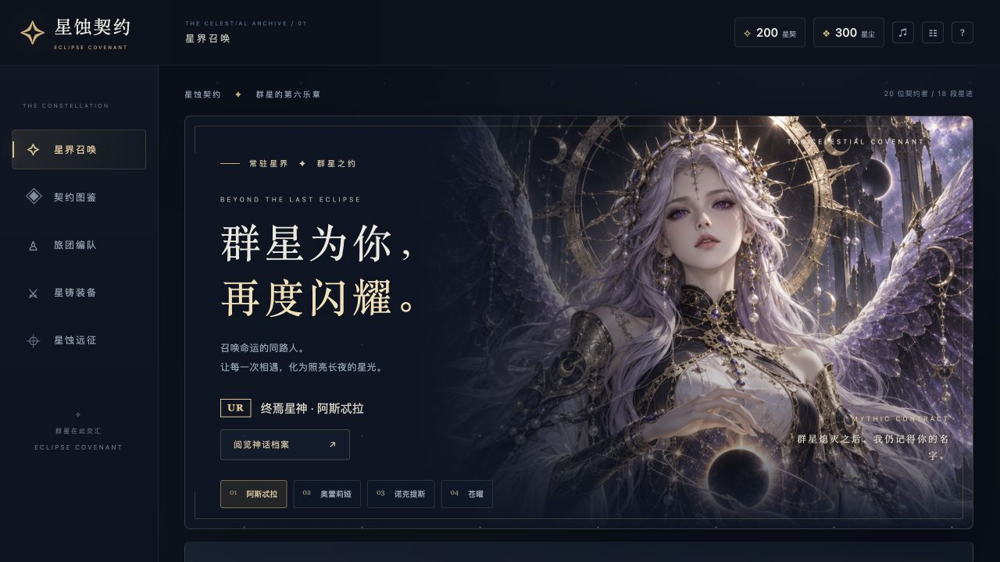
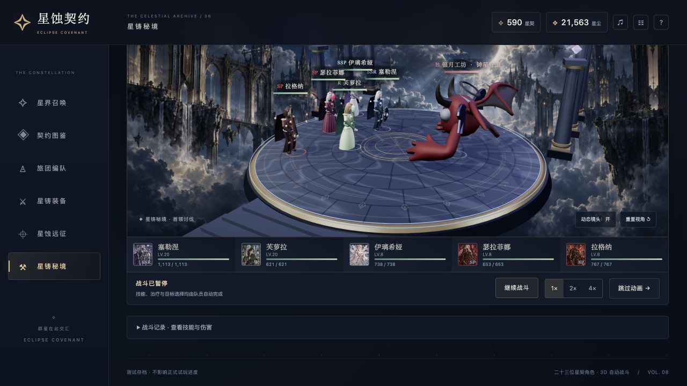
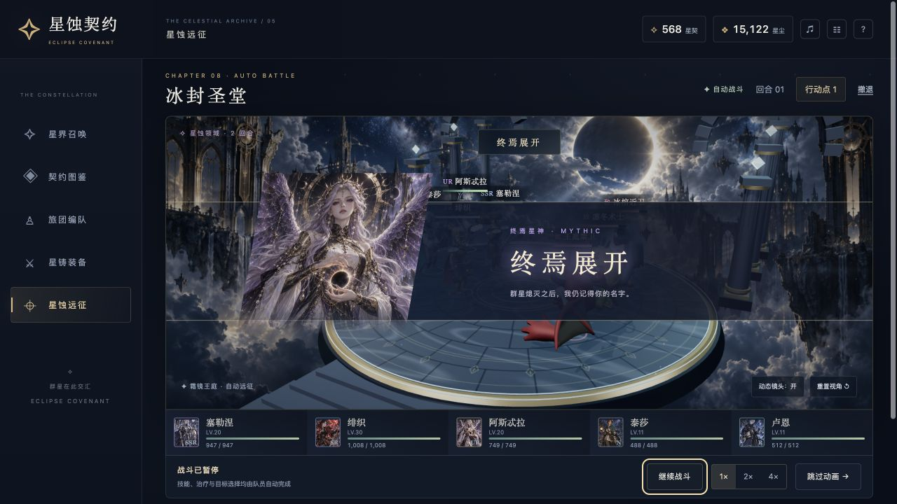
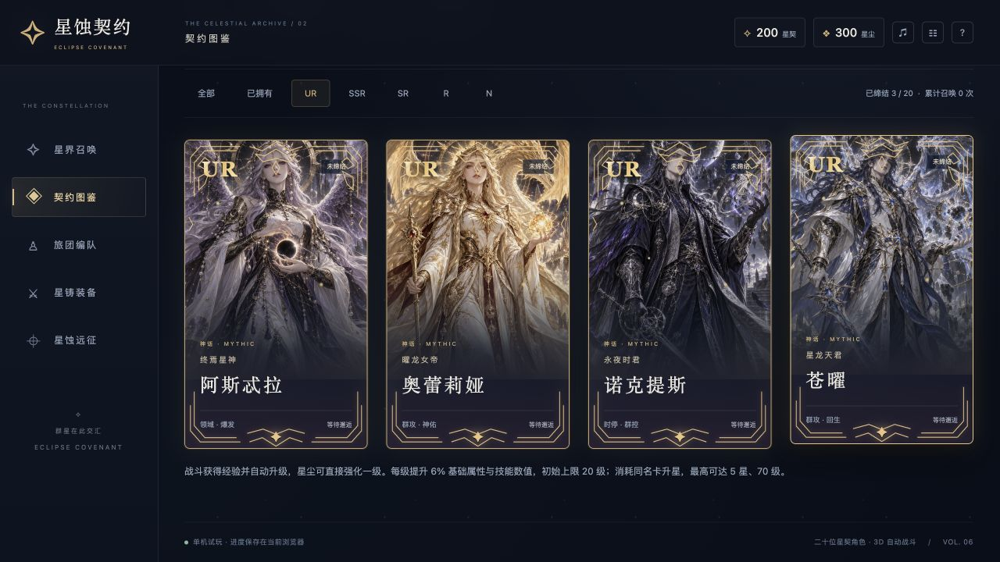
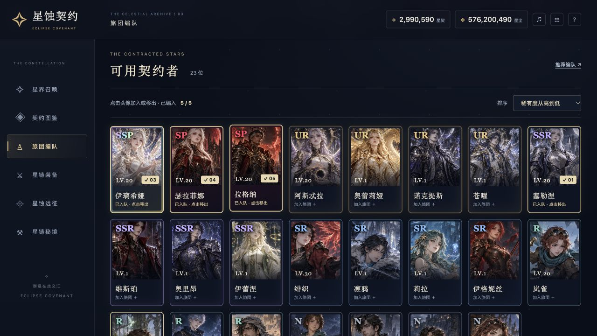
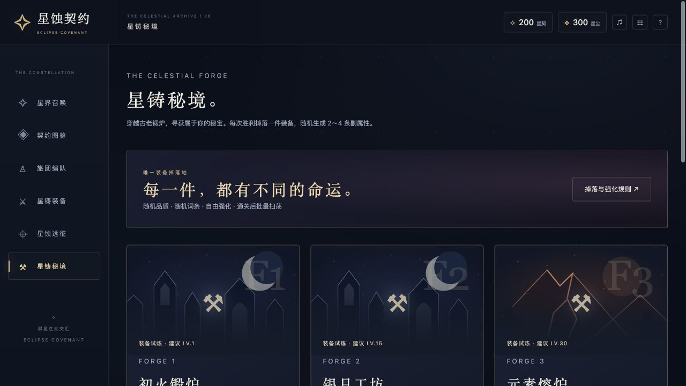
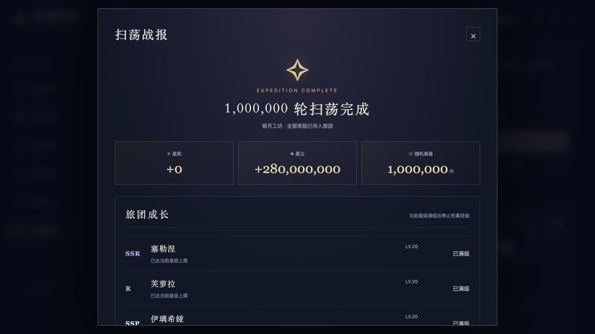

<div align="center">



<h1>星蚀契约：群星回响</h1>

<p><b>E C L I P S E &nbsp;·&nbsp; C O V E N A N T</b></p>

<h3>群星为你，再度闪耀。</h3>

<p>
搜集 108 位契约者 · 踏破 48 关星蚀远征<br>
在实时 3D 战场上，缔结属于你的星之契约
</p>

<p>
<a href="https://kylechen-1997.github.io/eclipse-covenant/"></a>


</p>

<sub>免费浏览器游戏 · 无需登录 · 无需下载 · 进度自动保存在本地</sub>

</div>

---

## ⚔️ 星蚀远征 · 3D 自动战斗

<p align="center"><i>「终焉展开 —— 群星熄灭之后，我仍记得你的名字。」</i></p>

<p align="center">


</p>

- **实时三维演出**：动态镜头、技能特效与战场环境实时渲染；UR 以上终极技以全屏立绘登台。
- **全自动决策**：普攻、技能、治疗、防御与目标选择由队伍自动完成，你只需专注编队与养成。
- **节奏由你掌控**：暂停、1× / 2× / 4× 加速、跳过结算——跳过使用相同战斗规则，不保证获胜。
- **16 大战区、48 关主线**：从镜海、苍木、赤月、时砂一路推进，直至万象与终焉。

---

## 🎴 签订契约 · 108 位契约者

<p align="center"><i>「召唤命运的同路人，让每一次相遇，化为照亮长夜的星光。」</i></p>



- **七档稀有度**：N / R / SR / SSR / UR / SP / SSP，每一位都有独立技能、实时三维形象与卡面设计。
- **108 人名录**：新增 77 张 1024 × 1536 独立角色立绘，40 位 SSR 及以上角色拥有动态展示，图鉴采用按需加载。
- **会呼吸的立绘**：高稀有度角色发丝轻摆、自然眨眼、衣摆随手势摇曳，背景纹丝不动——仿佛真的「活着」。
- **五人编队**：前排承伤、后排输出；领域、时停、回生、神佑、群攻、群体灼烧……自由搭配。
- **重复也有价值**：重复角色保留为升星材料，并额外奉上星尘；参战全员共享经验，退场成员也不例外。



| 稀有度 | 人数 | 代表契约者 | 战斗特色 |
|:---:|:---:|:---:|:---|
| **N** | 23 | 米洛 · 布兰 · 菲妮 · 泰莎 等 | 治疗 · 护盾 · 双击 · 急救 |
| **R** | 23 | 岚雀 · 芙萝拉 · 奎尔 · 卢恩 等 | 标记 · 群疗 · 贯穿 · 冰冻 |
| **SR** | 22 | 绯织 · 凛鸦 · 莉拉 · 伊格妮丝 等 | 灼烧 · 冰冻 · 治疗与护盾 · 贯穿 |
| **SSR** | 21 | 塞勒涅 · 维斯珀 · 奥里昂 · 伊蕾涅 等 | 护盾反击 · 吸血 · 雷霆群攻 · 群疗 |
| **UR** | 8 | 阿斯忒拉 · 奥蕾莉娅 · 诺克提斯 · 苍曜 · 西里乌斯 · 维加 · 阿斯特鲁 · 索拉拉 | 领域 · 神佑 · 时停 · 回生 · 星辉 · 宙域 |
| **SP** | 7 | 瑟拉菲娜 · 拉格纳 · 维蕾雅 · 塞维林 · 莫薇恩 · 塔洛尔 · 艾沃尔 | 群体灼烧 · 群体伤害与护盾 |
| **SSP** | 4 | 伊璃希娅 · 阿纳弥斯 · 卡乌莎 · 零谕 | 群攻 · 全队治疗与护盾 |

<sub>基础召唤概率：N 47.926% · R 32% · SR 16% · SSR 3.5% · UR 0.5% · 每位 SP 0.01% · 每位 SSP 0.001%</sub>

---

## ✨ 星界召唤 · 十万分之一的光

<p align="center"><i>「十万分之一的光，此刻与你相遇。」</i></p>


- **单抽、十连，或一口气 10,000 抽**：逐抽独立计算，保底、概率与单抽完全一致。
- **看得见的保底**：10 / 80 / 200 抽必得 SR+ / SSR+ / UR+，进度实时显示。
- **专属降临演出**：UR 金色、SP 绯红、SSP 炫光，全屏演出各有排面；奖励先入袋，跳过不丢卡。
- **保持悬念**：未获得的 SP / SSP 在图鉴中保持封印「???」，等待真正属于你的那一刻。

---

## 🗡️ 星铸秘境 · 每一件，都有不同的命运

<p align="center"><i>「穿越古老锻炉，寻觅属于你的秘宝。」</i></p>



- **8 座秘境、31 种装备设计**：武器、护甲、圣物三大部位，从初火锻炉一路深入零界星殿。
- **随机词条**：每件装备随机携带 2~4 条副属性——哪怕同名，也各有命运。
- **深度养成**：强化至 +15、觉醒至 5 星，副属性随机成长，打造只属于你的神装。
- **高阶挑战**：绯月王庭与零界星殿藏着 SP / SSP 神装，通关后开放扫荡。

---

## ⚡ 百万扫荡 · 一秒穿越百万战场



- **首通即自由**：扫荡 1 ~ 1,000,000 轮由你指定，10 / 100 / 1,000 / 1 万 / 10 万 / 100 万 一键预设。
- **后台批量结算**：Worker 线程计算，完成后一次写入存档；每件装备保留独立编号与词条，刷新不会重抽。
- **规则绝不打折**：扫荡与逐场胜利使用完全相同的奖励规则与掉落分布，战报自动汇总。

---

## 🚀 立刻开始

**在线游玩（推荐）**：<https://kylechen-1997.github.io/eclipse-covenant/> —— 桌面与手机浏览器打开即玩。

**开局礼遇**：可领取 7 位契约者、300 枚星契与 1,500 星尘，开局即能组出完整五人队。

**本地游玩**（Node.js 24，无需 `npm install`）：

```sh
npm start       # 打开 http://127.0.0.1:4180/
npm test        # 124 项游戏规则测试
npm run build   # 生成 dist/ 静态网站
```

> 进度保存在当前浏览器的 localStorage：更换设备、浏览器或清除网站数据会启用另一份存档。本游戏为纯单机，不上传任何数据。

---

<details>
<summary><b>🌐 部署到 GitHub Pages</b></summary>

1. GitHub 创建公开仓库 `eclipse-covenant`（`main` 分支），推送本项目——包含 `.github/workflows/pages.yml`、`scripts/` 与完整 `eclipse/` 目录；请保留素材目录结构，不要只上传 HTML，`dist/` 无需提交。
2. 仓库 **Settings → Pages → Source** 选择 **GitHub Actions**。
3. **Actions → Deploy Eclipse Covenant to Pages → Run workflow** 执行一次。工作流先跑测试，再打包并部署；日后每次推送 `main` 自动更新。
4. 发布包首页与仓库根目录的 `index.html` 都会进入卡牌游戏，相对路径资源兼容仓库子路径与自定义域名。旧射击游戏已归档至 `legacy/transport-ship.html`。

部署方案参考 [GitHub 官方 Pages 自定义工作流文档](https://docs.github.com/en/pages/getting-started-with-github-pages/using-custom-workflows-with-github-pages)。

</details>

<details>
<summary><b>🧩 技术一览</b></summary>

- **零运行时依赖**：原生 JavaScript + 内置 Three.js 0.160.1（MIT），无 CDN、无后端、无框架。
- **全本地素材**：11 种音效为本项目离线合成（本地 PCM 素材叠加 Web Audio），立绘、装备原画与三维模型均随仓库分发。
- **可验证**：130 项测试覆盖抽卡概率与保底、自动战斗、经验与升星、批量结算一致性、存档迁移与装备词条。
- **素材来源**：原画见 `eclipse/assets/visual/`，CC0 骨骼与怪物记录于 `eclipse/assets/models/manifest.json`，音频见 `eclipse/assets/audio/README.md`。

</details>

<p align="center">
<sub>完整玩法手册、概率明细与素材记录 → <a href="eclipse/README.md">游戏说明</a></sub>
</p>

## V12 · 长夜纪事

16 战区 / 48 关加入独立战前对白与战后发现，8 个阵营各有承诺和利益。第 6、21、36 关的决定记入旅途档案，影响阵营态度与终章文字；不改变战斗数值。既有通关存档可在档案里补作决定。

自动跳过动画的设置保存到本地，结算页集中显示下一征程、再次挑战、返回章节与扫荡；下一关仍检查解锁和编队门槛。新增 5 位 SP、3 位 SSP 与 8 张独立立绘，单角色基础概率保持 0.01% / 0.001%。西里乌斯采用用户提供的视频循环立绘，离屏和后台暂停，失败回退为静态图。
